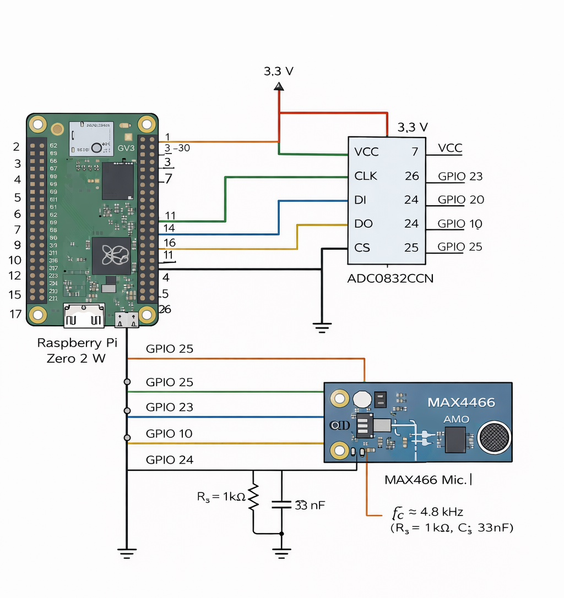

# Real-Time Audio FFT Visualizer on Raspberry Pi Zero 2 W

A register-level embedded C project that samples audio from a **MAX4466 microphone** through an **ADC0832CCN ADC**, performs **FFT-based frequency analysis**, and renders a **real-time waveform and spectrum visualizer on HDMI**.

This project demonstrates:

- Register-level GPIO programming on ARM
- External ADC interfacing using bit-banged serial communication
- Real-time signal sampling
- DSP processing with FFT
- Hardware + software integration on Raspberry Pi

---

# Demo

Demo video of the system running:

[Watch the demo](docs/demo/DEMO.mp4)

---

# Hardware

The project uses the following components:

- **Raspberry Pi Zero 2 W**
- **MAX4466 microphone amplifier**
- **ADC0832CCN 8‑bit ADC**
- **RC anti‑alias filter**
  - R = 1 kΩ
  - C = 33 nF

The microphone captures analog audio, which is filtered and converted to digital samples by the ADC.  
The Raspberry Pi reads the ADC through GPIO pins and performs digital signal processing.

---

# Hardware Diagram



The microphone output passes through a low‑pass RC filter and is connected to the **CH0 input of the ADC0832**.  
The ADC communicates with the Raspberry Pi using a synchronous serial protocol implemented through **bit‑banged GPIO pins**.

---

# GPIO Connections (BCM numbering)

| ADC0832 Pin | Raspberry Pi GPIO |
|-------------|-------------------|
| CS          | GPIO 8 |
| CLK         | GPIO 11 |
| DI          | GPIO 10 |
| DO          | GPIO 9 |
| VCC         | 3.3V |
| GND         | GND |

---

# Software Architecture

### Processing Pipeline

1. Initialize GPIO registers using `/dev/mem`
2. Configure GPIO pins for ADC communication
3. Read ADC samples using a bit‑banged driver
4. Sample audio at **10 kHz**
5. Apply **Hann window**
6. Perform **1024‑point FFT**
7. Compute frequency magnitudes
8. Render waveform and spectrum using **SDL2**

---

# Project Structure

```
audio-fft-visualizer-rpi
│
├── docs
│   ├── demo
│   │   └── DEMO.mp4
│   │
│   └── images
│       ├── hardware_schematic.png
│
├── src
│   └── audio_vis.c
│
├── .gitignore
├── LICENSE
├── Makefile
└── README.md
```

---

# Dependencies

Install the required libraries on Raspberry Pi OS:

```bash
sudo apt update
sudo apt install build-essential libfftw3-dev libsdl2-dev
```

---

# Build

Compile the program:

```bash
gcc -O2 -o audio_vis src/audio_vis.c -lfftw3 -lSDL2 -lm
```

Or use the Makefile:

```bash
make
```

---

# Run

Execute the program from the Raspberry Pi desktop session:

```bash
sudo ./audio_vis
```

If running from SSH:

```bash
export DISPLAY=:0
export XDG_RUNTIME_DIR=/run/user/1000
sudo -E ./audio_vis
```

---

# Features

- Register-level GPIO programming
- External ADC interface driver
- Fixed sampling rate (10 kHz)
- FFT-based audio spectrum analysis
- Real-time visualization
- SDL2 graphics rendering

------------------------------------------------------------
Author
------------------------------------------------------------

Vlad-Stefan Ciolacu<br>
GitHub: https://github.com/vladciolacu17

------------------------------------------------------------
License
------------------------------------------------------------

MIT License

